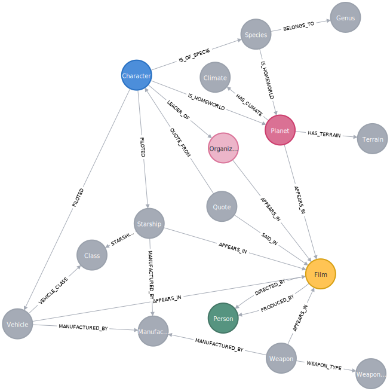

# Star Wars - Neo4j

Obtained from https://www.kaggle.com/code/jsphyg/star-wars-starter-for-csv/input

  CALL apoc.periodic.iterate(
  "MATCH (n) RETURN n",
  "DETACH DELETE n",
  {batchSize:10000, parallel:true})
  
  
  
  CALL apoc.schema.assert({},{},true) YIELD label, key RETURN *